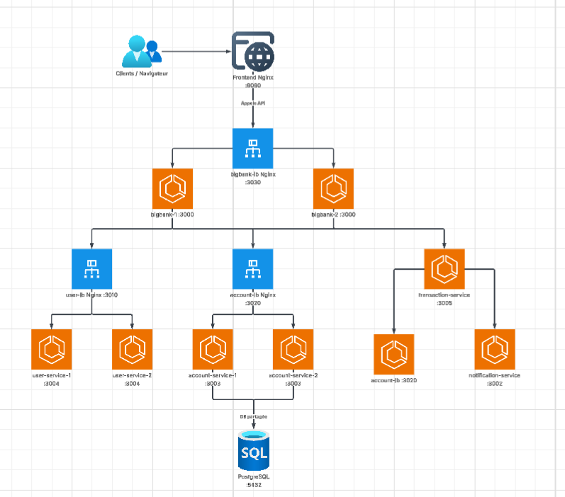

Algorithme : Round Robin

Qu'est-ce que le Round Robin ?

Le Round Robin est l'algorithme de load balancing le plus simple.
Il distribue les requêtes à tour de rôle entre les instances :

Algorithme : Round Robin

Round Robin est l'algorithme de load balancing le plus simple.
Il distribue les requêtes à tour de rôle entre les instances disponibles.

Exemple : si on a 2 instances, la requête 1 va sur instance-1, la requête 2 va sur instance-2, la requête 3 retourne sur instance-1, etc.

C'est le comportement par défaut de Nginx. Quand on déclare un upstream sans préciser d'algorithme, Nginx utilise automatiquement Round Robin.

Où l'utilise-t-on dans BigBank ?

user-lb (port 3010) distribue entre user-service-1 et user-service-2.
Les requêtes CRUD users sont courtes et uniformes, Round Robin convient parfaitement.

account-lb (port 3020) distribue entre account-service-1 et account-service-2.
Les deux instances partagent la même base PostgreSQL, donc les données sont toujours cohérentes.

bigbank-lb (port 3030) distribue entre bigbank-1 et bigbank-2.
L'API Gateway est stateless, chaque requête est indépendante.

Pourquoi Round Robin ?

Notre API est stateless : chaque requête contient toutes les informations nécessaires, il n'y a pas de session côté serveur.
Round Robin est simple à configurer, équitable (chaque instance reçoit le même nombre de requêtes), et suffisant quand les requêtes ont des temps de traitement similaires.

Autres algorithmes existants

Least Connections : envoie vers l'instance qui a le moins de connexions actives. Utile quand les requêtes ont des durées très variables.

Weighted Round Robin : comme Round Robin mais avec un poids. Par exemple 6 requêtes sur 10 vont vers instance-1 et 4 sur 10 vers instance-2. Utile quand les machines ont des puissances différentes.

IP Hash : toujours le même serveur pour la même IP client. Utile quand on a besoin de sticky sessions.

Limite observée : stockage en RAM

Lors de l'Ex-2, si vous êtes arrivés jusqu'ici, on a constaté que le user-service stocke les données en RAM.
Résultat : quand on crée Alice, elle n'existe que sur l'instance qui a reçu le POST.
L'autre instance ne la connaît pas. En faisant plusieurs GET, on voit une réponse sur deux vide.

La solution est d'utiliser une base de données partagée, comme on l'a fait pour account-service avec PostgreSQL.
Les 2 instances account-service lisent et écrivent dans la même base, donc les données sont toujours cohérentes peu importe quelle instance répond.


Solution : utiliser une base de données partagée (comme PostgreSQL pour account-service).
Les 2 instances account-service lisent/écrivent dans la même base → données toujours cohérentes.

Configuration Nginx

```nginx
# user-lb/nginx.conf
upstream user_backend {
    server user-service-1:3004;    # instance 1
    server user-service-2:3004;    # instance 2
}
# Pas besoin de préciser l'algorithme : Round Robin est le défaut

server {
    listen 3010;
    location / {
        proxy_pass http://user_backend;
    }
}
